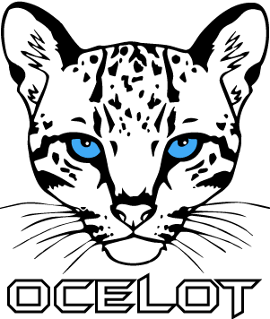

# Hi there 👋

🚀My name is Mohammad and this is about me:

"Dotnet developer with 8 years of experience in designing, developing and testing back-end projects. Experienced in web-based application and web service development and training staff within eCommerce technologies. Proven ability in Asp.net MVC, Asp.net Core, Web API and SQL Server. Familiar with Microservice and Service-Oriented architecture."

Currently I am working at shahr bank as software support team lead. Eager to learn and upgrade my knowledge.

You can find me on LinkedIn and Github
|  | |  |
|--|--|--|

  

  # Skills 💗💗💗

## Develpment

| Dotnet | C# | Asp.net MVC | Asp.net Core | Web API |
|--|--|--|--|--|
| ✔️ | ✔️ | ✔️ | ✔️ | ✔️ |

  

## Database

| SQL Server-TSQL | SQL Server-Tuning |
|--|--|
| ✔️ | ✔️ |

## Architecture
| Layered | Microservice | Service-Oriented Architecture | Clean
|--|--|--|--|
| ✔️ | ✔️ | ✔️ | ✔️ |

 

  
  
  
  
  
  
  
  
  

 

# 💻 Experience

*  **Deputy Director of Software** 

    > *Shahr Bank* 📆 *Jul 2021 – Present*

*  **Back-end Developer** 

    > *Shahr Bank* 📆 *Feb 2014 – Jul 2021*

*  **Co-Founder & Technical Lead** 

    > *Nikpay e-Commerce* 📆 *Aug 2016 – Present*

 

# 📚 Education

  -  **Amirkabir University of Technology - Tehran Polytechnic**

     + MA in Engineering📆 2009 – 2011

  
-  **Shahrood University of Technology**

    + Bachelor of engineering 📆 2005 - 2009

 

# 📝 Projects

-  **Designing and developing settlement service in order to manage acounting of acceptors**

+ a web service that manage all the settlement process of acceptors

-  **Implementing dockerize microservice architecture**

+ Dockerize dotnet core services on centos and monitor them with zabbix

-  **Implementi CI/CD routines**

+ Using Microsoft Azure DevOps to implement continuous integration and upload images on local registry and deploy them to VMs through countinuous delivery pipeline

 

# GitHub Activeness

 

# Github profile Trophies
