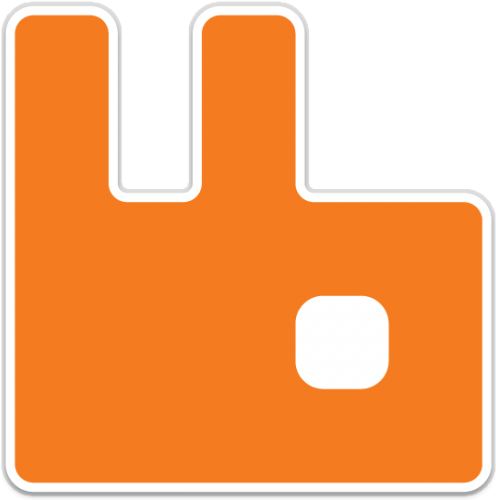

# Hi there 👋

🚀My name is Mohammad and this is about me:

"Dotnet developer with 8 years of experience in designing, developing and testing back-end projects. Experienced in web-based application and web service development and training staff within eCommerce technologies. Proven ability in Asp.net MVC, Asp.net Core, Web API and SQL Server. Familiar with Microservice and Service-Oriented architecture."

Currently I am working at shahr bank as software support team lead. Eager to learn and upgrade my knowledge.

You can find me on LinkedIn and Github
|  | |
|--|--|

  # Skills 💗💗💗

## Develpment

| Dotnet | C# | Asp.net MVC | Asp.net Core | Web API |
|--|--|--|--|--|--|
| ✔️ | ✔️ | ✔️ | ✔️ | ✔️ | ✔️ |

  

## Database

| SQL Server-TSQL | SQL Server-Tuning |
|--|--|
| ✔️ | ✔️ |

## Architecture
| Layered | Microservice | Service-Oriented Architecture | Clean
|--|--|--|--|
| ✔️ | ✔️ | ✔️ | ✔️ |

 

  
  

# 💻 Experience

>  **Deputy Director of Software** @ *Shahr Bank*

> 📆 *Jul 2021 – Present*

>  **Back-end Developer** @ *Shahr Bank*

> 📆 *Feb 2014 – Jul 2021*

>  **Co-Founder & Technical Lead** @ *Nikpay e-Commerce*

> 📆 *Aug 2016 – Present*

# 📚 Education

-  **Amirkabir University of Technology - Tehran Polytechnic**

+ MA in Engineering

📆 2009 – 2011

  
-  **Shahrood University of Technology**

+ Bachelor of engineering 📆 2005 - 2009
  
# 📝 Projects

-  **Designing and developing settlement service in order to manage acounting of acceptors**

+ a web service that manage all the settlement process of acceptors

-  **Implementing dockerize microservice architecture**

+ Dockerize dotnet core services on centos and monitor them with zabbix

-  **Implementi CI/CD routines**

+ Using Microsoft Azure DevOps to implement continuous integration and upload images on local registry and deploy them to VMs through countinuous delivery pipeline

